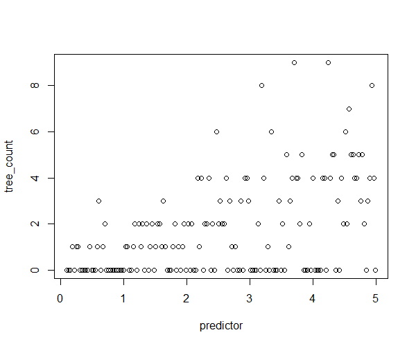
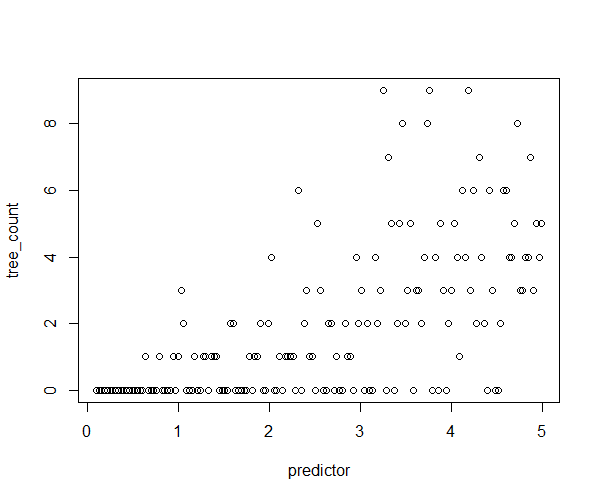
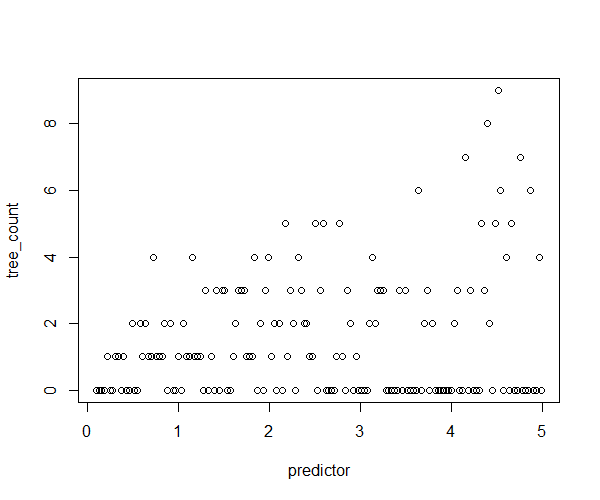
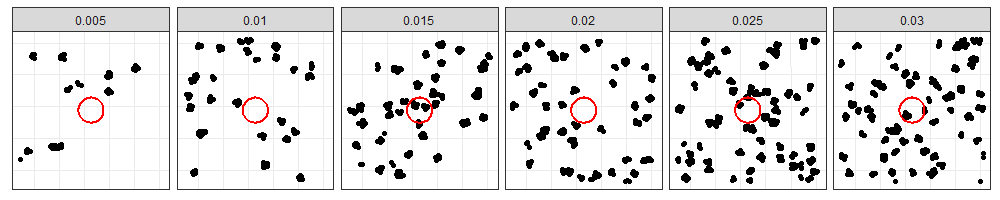
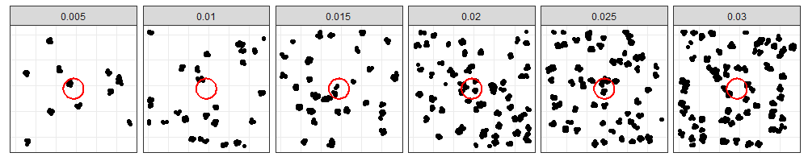
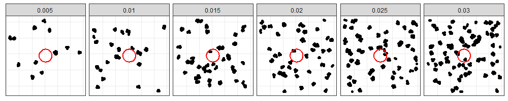
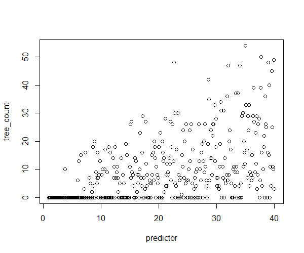

# Generation of simulated zero-inflated data

The single script in this repo (in the "scripts" folder) generates four example zero-inflated datasets:

## Constant zero inflation

Data file: simulated_constant_zeroinfl.csv

Counts are generated by a Poisson process, with the mean count (Piosson lambda parameter) varying with the variable called "predictor". But a random 33% of the counts are set to zero to simulate zero inflation. This produces the following dataset:

## Varying zero-inflation

Data file: simulated_variable_zeroinfl.csv

Counts are generated by a Poisson process, with the mean count (Piosson lambda parameter) varying with the variable called "predictor". But 33% of the counts are randomly assigned a value of 0, with a probability that decreases as the "predictor" increases. This produces the following dataset:

## Varying (reverse direction) zero-inflation

Data file: simulated_variable_zeroinfl.csv

Counts are generated by a Poisson process, with the mean count (Piosson lambda parameter) varying with the variable called "predictor". But 33% of the counts are randomly assigned a value of 0, with a probability that _increases_ as the "predictor" increases. This produces the following dataset:

## Varying (possible) zero-inflation resulting from spatial sampling

Data file: simulated_variable_zeroinfl.csv

This dataset is designed to simlate tree counts obtained by using small plots to sample a highly clustered tree distribution. Hypothetical plots (7.7 m x 7.7 m = 60 sq m = the area of a regen plot) are filled with a simulated distribution of trees. The distribution consists of clusters (radius = 0.3 m) of trees, with a mean number of trees per cluster = 8. The density of clusters varies with the predictor called "predictor".

Here are exaple landscapes of clustered trees with different densities of clusters from left to right (red circle is the size of a 4.4 m regen plot, for scale):

Another random draw:

Another random draw:

Here is what the resulting dataset looks like:

